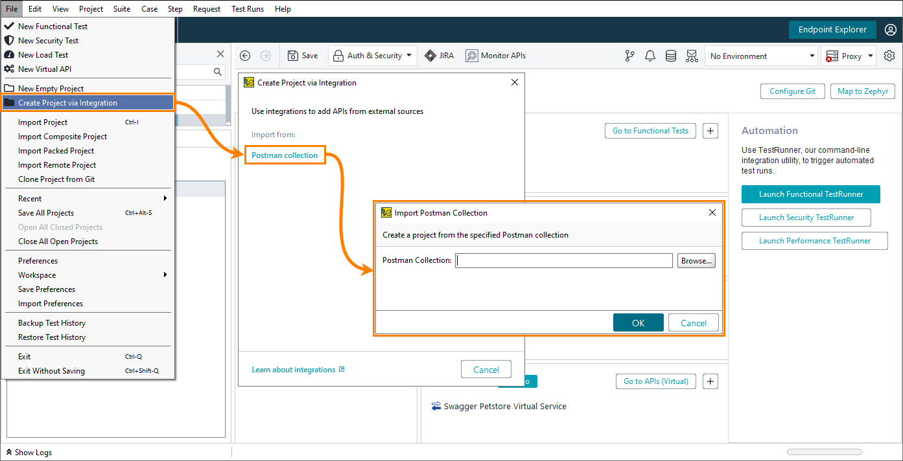

# Postman Plugin for ReadyAPI

This repository contains source code files for the Postman Plugin for ReadyAPI. You can use this plugin to import your Postman collections.

## Plugin Info

- Author: SmartBear Software (http://smartbear.com)
- Plugin version: 2.0

## Requirements

The plugin requires ReadyAPI version 2.6 or later.

## Working With the Plugin

### Install the plugin


To install the plugin:

- In ReadyAPI, switch to the **Integrations** tab.
- Find **ReadyAPI Postman Plugin** and click **Install**.
- Confirm that you want to download and install the plugin.

### Import the collection



To import the collection:

- Select **File > New Project**.
- In the **New Project** dialog, select **API Definition > Postman collection**. Click **Import**.
- In the **Import Postman Collection** dialog, click **Browse** and select the Postman collection to import.

## Build the plugin

If you want to build the plugin yourself all you need to do is clone this repository locally and run

```
mvn clean install
```

which will create the plugin jar in the target folder

## Additional Information

You can find more information about importing the plugin and conversion from Postman collection to ReadyAPI project in the [documentation](https://support.smartbear.com/readyapi/docs/integrations/postman.html).